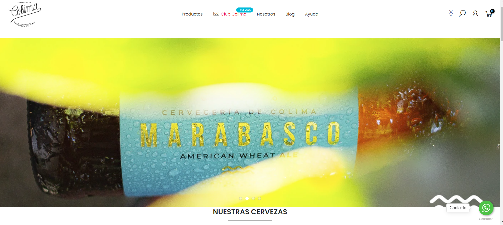
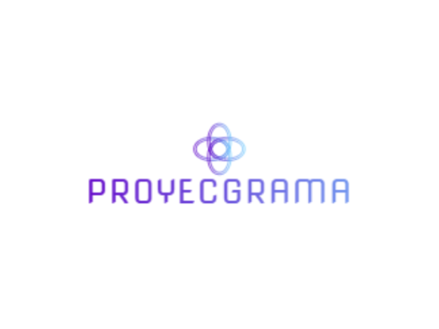

# Proyecgrama : Proyecto DevJump

## Información acerca del proceso de la página "Proyecgrama"

* Division de tareas

* Metodología que adoptamos

* Conclusiones en cada reunion

* Wireframe

* Logo y secciones

* Complicaciones

* Toma de decisiones finales 

## Division de tareas 

La división de tareas fue sencilla . Todos ibamos a aportar en la eleccion de wireframe, colores, imagenes, etc . Se charlaba con el grupo a estar dispuestos a recibir cualquier idea/sugerencia sobre las tareas de cada uno y siempre buscar que mejorar .

-Gonzalo Alvarez : Rol como desarrollador - Armado de wireframe . // agregar aca datos mas personales , como como se sientes etc

-Natalí Lescano : Rol como desarrollador - Armado de wireframe .

-Guadalupe Garcilazo: Rol como líder - Documentación del día a día . Armado de README . Logo . Nombre de proyecto .

-Lautaro Coria: Como nuevo integrante del Equipo 2, asumio su rol como desarrollador - Armado de wireframe .

" Traje un poco de experiencia para compartir e implementar y también adquirí nuevas de este equipo que me recibió de la manera más amena. A pesar del poco tiempo, pudimos reflejar con éxito las nuevas medidas sin afectar a lo ya establecido y logrando una integridad en forma plena. Como desarrollador asumo el rol de la mejora constante, de la escucha, del compromiso, la ayuda y la confianza en el trabajo de mi equipo . "

## Metodologías que adoptamos

Adoptamos como metodología el método SCRUM .           //link de JIRA

Para hacer uso de la metodología Scrum, pusimos a disposición del equipo la herramienta Jira Software. Creamos un proyecto donde establecimos las diferentes tareas de acuerdo a los requerimientos del cliente y organizamos los diferentes Sprints que nos van a guiar en las toma de decisiones con base en las prioridades y tiempos pactados.

## Conclusiones en cada reunión: 12/04 - 21/04

_Martes 12/04_ : Asignasión de grupos - Elección de líder .  
Este dia comenzamos haciendo una lectura de requisitos y cosas a tomar en cuenta, aclaramos dudas, organizamos y charlamos por donde queria llevar cada uno el proyecto o cual era su idea . Hicimos una busqueda de wireframes por diferentes paginas y aplicaciones. 

## Wireframe

Comenzamos inspirandonos en esta primer foto tomada de Pinterest .

El grupo coicidio en que nos gustaba ese tipo de estructura . Un header hortizontal con su logo y sus secciones . Luego, una imagen que ocupa todo el ancho de la pantalla y un texto abajo de tipo introduccion . Despues, agregar en cada caja su respectivo lenguaje y por ultimo un footer .

Fuimos teniendo en claro que no lo ibamos a hacer tal cual sino ir modificandole algunas cositas para que tambien tenga una marca nuestra, a partir de nuestros gustos y elecciones .

Luego vimos esta pagina donde cumplia con la mayoria de los gustos del grupo y del wireframe anterior . https://cerveceriadecolima.com/#

Ibamos charlando cosas que teniamos que cambiar como poner el logo en medio, sacar los iconos del costado e ir eligiendo colores. 

El footer tambien fue algo en lo que estuvimos inspirados, en el tamaño, color y forma . Es muy parecido al de Arbusta .

Nuestro footer esta 100% inspirado en el de Arbusta .

_Miercoles 13/04_ : Comienzo de wireframe .  
Este día Nati sugirió una plataforma para ir volcando nuestras ideas en él . La plataforma elegida había sido *Whimiscal* https://whimsical.com/proyecto-Ns7c8K4aZh3rmAxjK9bai6 . Nuestro primer wireframe donde plasmamos todas nuestras ideas, gustos e inspiraciones :

     Todavia faltaba tomar decisiones de tipografía, colorimetría, secciones e imagenes . *Este wireframe fue inspiracíon para el ultimo elegido* .

_Lunes 18/04_ : Elección de nombre, logo y secciones que Proyecgrama iba a tener . Seguimiento del wireframe .  
Este día tuvimos nuestra primer Daily grupal . En la daily charlamos lo que iba a hacer cada uno y si teniamos algun impedimento o algo para decir . Gonza y Nati continuaron con el wireframe de cada sección y dispositivo . Seguimos tirando ideas para cada una de las secciones , probamos tonalidades dentro de los colores de Arbusta y tipografías acordes. Guada creó el nombre y diseño el logo . Se creó el repositorio y se fueron completando los README . 

## Logo y Secciones

   --   

_Martes 19/04_ : Seguimos con el wireframe.  
Surgieron dudas en el color del logo, en si iba a combinar con el resto de la página, asi que estuvimos probando nuevos logos .

   --     Finalmente decidimos dejar el anterior ya que queriamos darle color a la pagina, que sea llamativa visualmente y con el color blanco de estos no pasaba .

_Miercoles 20/04_ : Nuevos cambios . Nuevo integrante . Nuevas ideas . Rehicimos el wireframe .  
Este dia fue de cambios, se unió Lauti, el llego con un proyecto en mente distinto y ideas diferentes . El grupo le comentó todo lo que habiamos hecho hasta este día y estaba dispuesto a recibir ideas y cambios . Mostramos el wireframe y allí surgieron muuuchas cosas . 

## Complicaciones 

Principalmente la plataforma que usabamos _Whismical_ no se amoldaba a lo que necesitabamos, habían cosas que no nos dejaba realizar (como modificar el ancho y alto de una imagen) . Entonces, Lauti sugirió la plataforma _Figma_ él ya estaba utilizandola con su grupo anterior entonces se ofreció a explicarnos sobre esta e ir pasando todo el wireframe ahi . Accedimos todos y juntos fuimos definiendo junto con Lauti el nuevo wireframe .  
Todo el resto del dia fue terminar el nuevo wireframe que nos gustara y estemos todos de acuerdo . 

## Toma de decisiones finales 

_Jueves 21/04_ : Trabajamos en el refinamiento. Volvimos a las preguntas esenciales como ¿Cuáles eran los requisitos? Y con base en esto pensamos en las secciones de nuestro sitio .
 
A fin de la reunión decidimos dividir tareas para agilizar el proceso teniendo en cuenta el tiempo pactado .

Guadalupe: Exclusivamente de la documentación .  
Natali: De la maquetación del formulario de Login y Registro en su tamaño escritorio y responsivo.  
Gonzalo: De la maquetación de la sección de los diferentes lenguajes, con foco en cumplir los requerimientos de: “Clases con párrafos que explique la misma” y “Visualización por lenguaje” .  
Lautaro: De la maquetación de la página de Inicio o Home, asegurándose de ultimar detalles pactados en la Dayli.  

[Wireframe elegido](https://www.figma.com/file/6Vz4FdXkiOXlXJduHf1jVP/Untitled?node-id=0%3A1)

