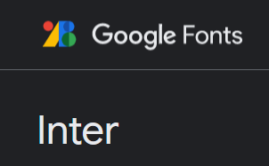

# Proyecgrama : Proyecto DevJump

## Información acerca de la página "Proyecgrama"

* Nombre

* Logo 

* Paleta Cromática

* Tipografía

* Maquetado/Wireframe

* Elección de estructura y secciones

* Inspiraciones // Referentes

* Eleccion de imágenes 

* Opciones a futuro

## Nombre 

Proyecgrama es una plataforma de educación tecológica que impulsa nuevos talentos que buscan ser insertados dentro del mercado IT .  
El objetivo es acompañar su desarrollo profesional brindando las capacitaciones técnicas necesarias para abrirles paso al mundo de la programación.

Su nombre surgio de la mezcla entre - Proyecto y Programa - . 

## Logo

El logo cumple con la colorimetría de la pagina , el estilo y su fin . 

## Paleta Cromática

Seleccionamos los colores que representan a Arbusta .

## Tipografía

Seleccionamos este tipo de letra legible, elaborado y diseñado para pantallas .

## Maquetado/Wireframe

https://www.figma.com/file/6Vz4FdXkiOXlXJduHf1jVP/Untitled?node-id=0%3A1

## Inspiraciones // Referentes 

Proyecgrama esta inspirado en nuestra experiencia como estudiantes en progrmación .  

Nuestra web tiene como finalidad :

Fácil usabilidad   
Contenido de calidad   
Encabezado reelevante   
Directo   
Publico objetivo   
Formato adecuado para cada contenido   
Información de contacto  

Webs de las cuales tomamos ideas e inspiraciones (Tanto wireframe como contenido) :

* https://cerveceriadecolima.com/# (wireframe)
* https://arbusta.net/en/home/ (wireframe, paleta de colores, tipografía)
* https://ed.team/categorias/tecnologia (estilo de volcar el contenido)
* https://www.coderhouse.com/ (wireframe, estilo de contenido )

## Elección de estructura y secciones

