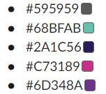
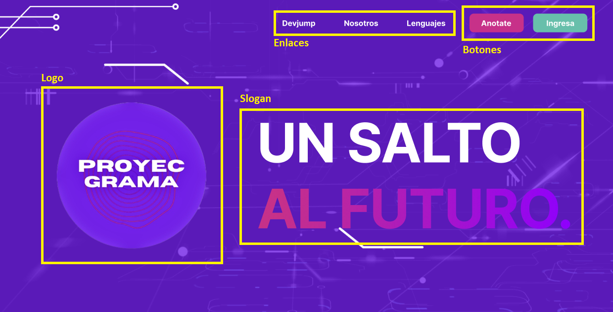
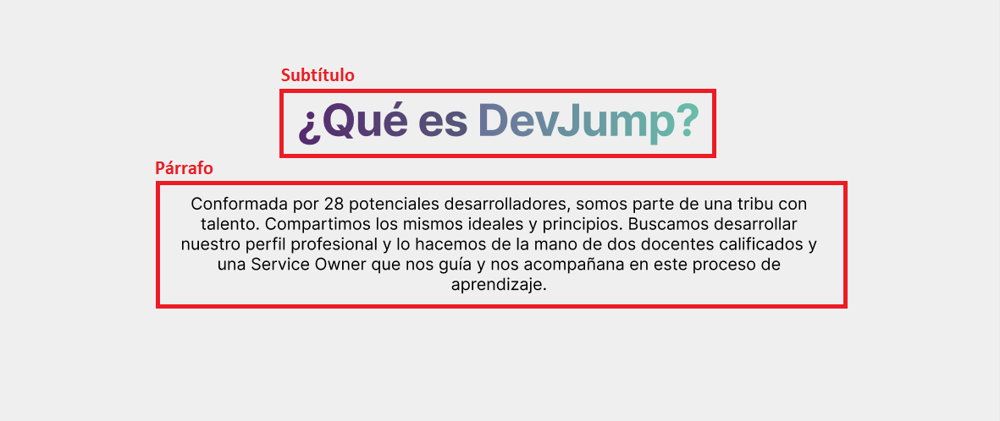
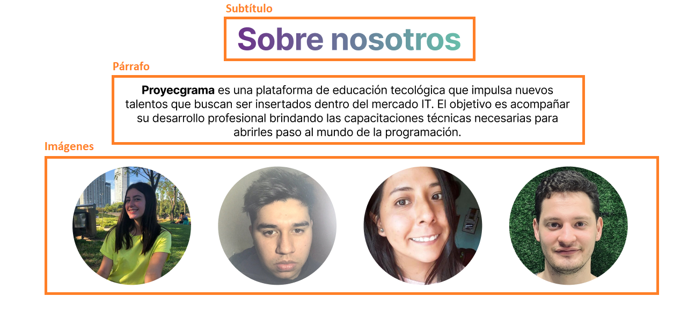
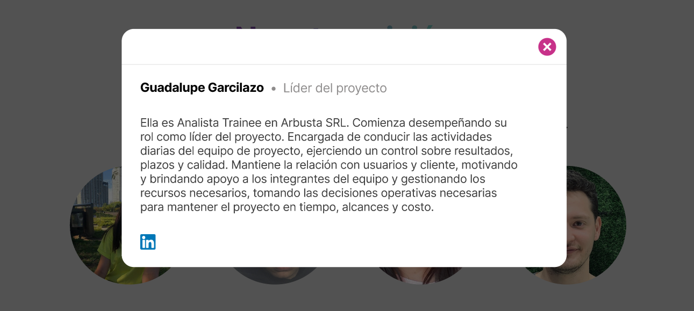
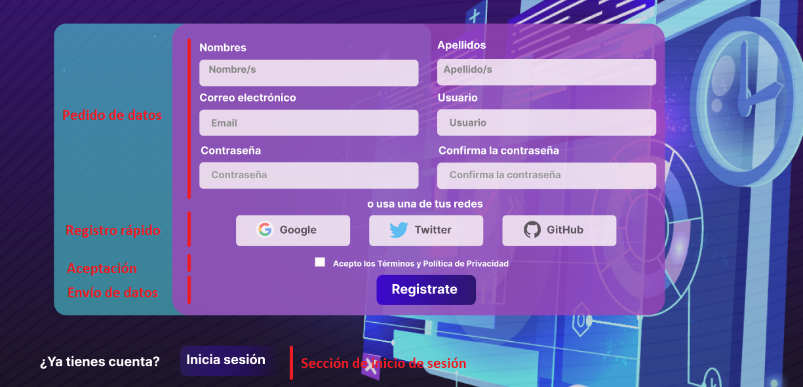

# Proyecgrama : Proyecto DevJump

## Información acerca de la página "Proyecgrama"

* Nombre

* Logo 

* Paleta Cromática

* Tipografía

* Maquetado/Wireframe

* Elección de estructura y secciones

* Inspiraciones // Referentes

* Opciones a futuro

* Manual para el usuario

## Nombre 

Proyecgrama es una plataforma de educación tecológica que impulsa nuevos talentos que buscan ser insertados dentro del mercado IT .  
El objetivo es acompañar su desarrollo profesional brindando las capacitaciones técnicas necesarias para abrirles paso al mundo de la programación.

Su nombre surgio de la mezcla entre - Proyecto y Programa - . 

## Logo

El logo cumple con la colorimetría de la pagina , el estilo y su fin . 

## Paleta Cromática

Seleccionamos los colores que representan a Arbusta .

## Tipografía

Seleccionamos este tipo de letra legible, elaborado y diseñado para pantallas .

## Maquetado/Wireframe

Para la realización del maquetado el equipo buscó plataformas dedicadas al área del Wireframe, las cuales son Figma y Whismical. 

El equipo optó en usar la primera plataforma para llevar a cabo las ideas en mente. Luego de elegir la plataforma se eligió la paleta de colores que llevaría la página a crear, los cuales fueron inspirados en Arbusta . Como tercer paso, se comenzó el maquetado para el cual se diseñó un Nav y un footer como también se diseñaron distintas secciones que tendrá la página. Por último, se agregaron fotos y se pensó como posicionar los distintos tipos de secciones para que el visitante/usuario tenga una buena experiencia en la página web.

[Wireframe](https://www.figma.com/file/6Vz4FdXkiOXlXJduHf1jVP/Untitled?node-id=0%3A1)

## Inspiraciones // Referentes 

Proyecgrama esta inspirado en nuestra experiencia como estudiantes en progrmación .  

Nuestra web tiene como finalidad :

Fácil usabilidad   
Contenido de calidad   
Encabezado reelevante   
Directo   
Publico objetivo   
Formato adecuado para cada contenido   
Información de contacto  

Webs de las cuales tomamos ideas e inspiraciones (Tanto wireframe como contenido) :

* https://cerveceriadecolima.com/# (wireframe)
* https://arbusta.net/en/home/ (wireframe, paleta de colores, tipografía)
* https://ed.team/categorias/tecnologia (estilo de volcar el contenido)
* https://www.coderhouse.com/ (wireframe, estilo de contenido )

## Elección de estructura y secciones

Para la sección de Inicio o también conocida como Home, tomamos como premisa la navegabilidad. Queremos una herramienta que además de ofrecer recursos técnicos y profesionales, sea fácil de usar. La legibilidad y la simpleza, combinado con lo moderno, son factores que ayudan al usuario a no caer en el aburrimiento o aturdimiento por no entender la finalidad de la página mientras navega por la misma. Es por eso mismo que la primera página con la que se encuentra el usuario tiene colores amigables, textos espaciados y cortos (que van al punto), y con nada más que las funcionalidades principales que son las primeras a las que el usuario necesita recurrir al tener el primer contacto con el sitio . 

Acceder/Registrarse, Cursos y presentación del proyecto .

<!-- ## Opciones a futuro

Esta la posibilidad del cual cuando la web se haga real, surjan algunas modificaciones . 
 -->

 
 

## Manual para el usuario:
## Empieza el recorrido de nuestra Página Web
***

 

### `1. Página de Inicio`
 

Cuando el usuario ingresa por primera vez al sitio web, lo primero que vizualizará es un banner violeta muy llamativo y animado que contiene, en su centro y de tamaños considerables, por un lado una frase y por el otro lado el logo de la organización: 

* Hacia la derecha se encuentra la frase "UN SALTO AL FUTURO", presentando al slogan. De la cual su primera parte "UN SALTO" tiene estilos sólidos y simples de color blanco; y su segunda parte "AL FUTURO" colocada en una siguiente linea, presenta estilos degradados que van desde el rosado hacia el violeta (colores que representan a la empresa).

* Hacia la izquierda, alineado al slogan, se visualiza el logo, también adquiriendo y presentando colores representativos de la organización.

Lo segundo que el usario va a reconocer es el encabezado transparente con los enlaces para nevegar a través de la web. Así, el usuario empecerá su recorrido haciéndose una idea de cuáles son las secciones o contenido que puede llegar a entontrar navegando por la herramienta.

Situado en lo más alto y alineado horizontalmente hacia la izquierda se puede leer las diferentes secciones:

* DevJump
* Nosotros
* Lenguajes

Y dos botones:

* Anotate
* Ingresá

Tomando el pimero un color de fondo rosado y el segundo un color verde-agua.

Ambos, secciones y botones, son enlaces que desde el inicio le permiten al usuario manejar una interactividad con el sitio y enviar una sugerencia a ser parte de nuestra comunidad.

 

 

### `2. ¿Hacia dónde nos dirigen los enlaces del encabezado?`

 

### `2.1 DevJump`
 

La interacción del usuario con el enlace "DevJump" ubicado en el encabezado, provoca un scroll de volocidad lenta que lo situa sobre una sección de fondo gris muy claro que está directamente por debajo del banner violeta inicial y que se compone de dos simples partes centradas vertical y horizontalmente:

* Sutítulo "¿Qué es DevJump?": Con un estilo degradado comenzando con un violeta y terminando en un verde-agua, esta frase sugiere al usuario una idea sobre lo que va a leer.

* Párrafo: Inmediatamente debajo del subtítulo, de color negro y líneas espaciadas, el usuario conoce el origen y nuestra visión a través de un texto corto, directo, cómodo para la vista y de fácil lectura gracias a los estilos establecidos.

 

 

### `2.2 Sobre nosotros` 

 

La interacción del usuario con el enlace "Nosotros", también genera un scroll de velocidad lenta pero que esta vez lo posiciona en una sección de fondo blanca que está por debajo de la anterior. Se pueden distinguir es este apartado tres principales divisiones:

* Subtítulo "Sobre nosotros": Manteniendo los estilos elegidos para los títulos de las diferentes secciones de la página.
* Párrafo: Breve introducción sobre qué es Proyecgrama y el objetivo que persigue.
* Sección de imágenes.

 

 

Hablemos sobre la sección de imágenes. Éstas son interactivas y un único click habilita una ventana emergente por encima que expande el perfil del integrante del proyecto.

 

 

En este caso la pesona seleccionada fue Guadalupe Garcilazo que comenzó su rol como líder del proyecto (tal y como lo menciona en la tarjeta). Podemos observar además su nombre, un párrafo descriptivo donde se desarrolla su función, un enlace a su perfil de LinkedIn para conocer más sobre su trabajo, y por encima en el rincón superior izquierdo un botón para cerrar la venta y volver a la página principal.

----------------------------------------------------------------------------
----------------------------------------------------------------------------
----------------------------------------------------------------------------
----------------------------------------------------------------------------

 

### `2.4 Anotate`

 

Este botón dirige al usuario a una nueva página donde se encuentra el formulario de registro. En ella se puede ver una imagen de fondo con un diseño tecnológico donde predomida en el color azul. Centrado, en el frente, y ocupando casi todo el ancho de la pantalla, el formuario tiene un estilo redondeado con un fondo violeta transparentado que deja ver el fondo de atrás. Contiene diferentes campos donde el usuario puede ir completando con sus datos:

* Nombre/s
* Apellido/s
* Correo electrónico
* Usuario
* Contraseña
* Confirmar la contraseña

Y debajo una mini-sección donde puede iniciar sesión con alguna de las plataformas más populares:

* Gmail
* Twitter
* Github

Una casilla de aceptación de Términos y Política de Privacidad, y por último un botón con la leyenda "Registrate" para enviar los datos del formulario y completar el registro.

Finalmente, por fuera del formulario de registro y específicamente en el rincón inferior izquierdo, en caso de que el usuario posea una cuenta y no necesite este paso de registro, puede dirigirse a la sección correspondiente para dar inicio a su perfil.
 

 

### `2.5 Ingresá`

 

El último enlace del encabezado también es un botón, tiene un formato similiar y sigue la misma línea que el formulario de registro. Acá se puede observar nuevamente una imagen de fondo con un formulario de inicio al frente y centrado que se divide en dos columnas. La primera, hacia la izquierda, contiene botones que le permiten al usuario inisiar sesión vinculando los datos con otras cuentas existentes:

* Google 
* Twitter
* Github

La columna de la derecha, por su parte, contiene dos campos primordiales, requeridos y obligatorios para que el usuario pueda ingresar a su cuenta en Proyecgrama:

* Email/Nombre de usuario  
* Contraseña

