# Proyecgrama : Proyecto DevJump

## Información acerca del proceso de la página "Proyecgrama"

* Division de tareas

* Metodología que adoptamos

* Conclusiones en cada reunion

* Wireframe

* Logo y secciones

* Complicaciones

* Toma de decisiones finales 

* Semana del armado de la página

## Division de tareas 

La división de tareas fue sencilla . Todos ibamos a aportar en la eleccion de wireframe, colores, imagenes, etc . Se charlaba con el grupo a estar dispuestos a recibir cualquier idea/sugerencia sobre las tareas de cada uno y siempre buscar que mejorar .

-Gonzalo Alvarez : Rol como desarrollador - Armado de wireframe .

"Soy Gonzalo Alvarez y mi rol en este proyecto es como desarrollador. Inicié en  el mundo de la programación mediante el equipo DevJump, ahí mismo, aprendí como crear una página web desde cero con el uso de HTML5 y darle "Vida" con CSS y JavaScript. Gracias a todo lo aprendido pude implementar ideas a Proyecgrama y llevarlas a cabo."

-Natalí Lescano : Rol como desarrollador - Armado de wireframe .

"Como integrante del equipo, asumí también el rol de líder y de desarrollador para este proyecto. Acordando pudimos hacer un gran cambio en el proyecto con combinación de nuevas ideas y cambios que son geniales. Me siento bien en ser parte del equipo 2, hay un gran apoyo mutuo."

-Guadalupe Garcilazo: Rol como líder - Documentación del día a día . Armado de README . Logo . Nombre de proyecto . 

"Como integrante del equipo, asumo mi rol como desarrolladora. Estoy en este proyecto desde sus inicios y mis apoyos soncombinar e integrar ideas con mis compañeros, motivando e incentivando a crecer y mejorar día a día."

-Lautaro Coria: Como nuevo integrante del Equipo 2, asumio su rol como desarrollador - Armado de wireframe .

"Traje un poco de experiencia para compartir e implementar y también adquirí nuevas de este equipo que me recibió de la manera más amena. A pesar del poco tiempo, pudimos reflejar con éxito las nuevas medidas sin afectar a lo ya establecido y logrando una integridad en forma plena. Como desarrollador asumo el rol de la mejora constante, de la escucha, del compromiso, la ayuda y la confianza en el trabajo de mi equipo . "

## Metodologías que adoptamos

Adoptamos como metodología el método SCRUM .

Link de Jira: https://lautarocoria.atlassian.net/jira/software/c/projects/PRG/boards/2?atlOrigin=eyJpIjoiMjgxOTkzOTEwZTJiNGVhYjkyYWJlZGEzZWQ0MTk1ZjAiLCJwIjoiaiJ9

Para hacer uso de la metodología Scrum, pusimos a disposición del equipo la herramienta Jira Software. Creamos un proyecto donde establecimos las diferentes tareas de acuerdo a los requerimientos del cliente y organizamos los diferentes Sprints que nos van a guiar en las toma de decisiones con base en las prioridades y tiempos pactados.

## Conclusiones en cada reunión: 12/04 - 21/04

_Martes 12/04_ : Asignasión de grupos - Elección de líder .  
Este dia comenzamos haciendo una lectura de requisitos y cosas a tomar en cuenta, aclaramos dudas, organizamos y charlamos por donde queria llevar cada uno el proyecto o cual era su idea . Hicimos una busqueda de wireframes por diferentes paginas y aplicaciones. 

## Wireframe

Comenzamos inspirandonos en esta primer foto tomada de Pinterest .

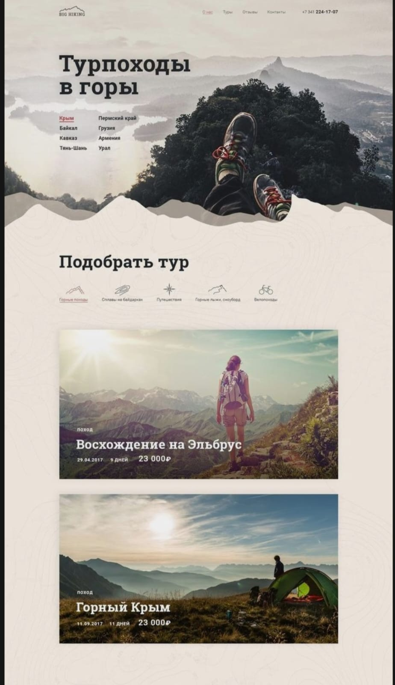

El grupo coicidio en que nos gustaba ese tipo de estructura . Un header hortizontal con su logo y sus secciones . Luego, una imagen que ocupa todo el ancho de la pantalla y un texto abajo de tipo introduccion . Despues, agregar en cada caja su respectivo lenguaje y por ultimo un footer .

Fuimos teniendo en claro que no lo ibamos a hacer tal cual sino ir modificandole algunas cositas para que tambien tenga una marca nuestra, a partir de nuestros gustos y elecciones .

Luego vimos esta pagina donde cumplia con la mayoria de los gustos del grupo y del wireframe anterior . https://cerveceriadecolima.com/#

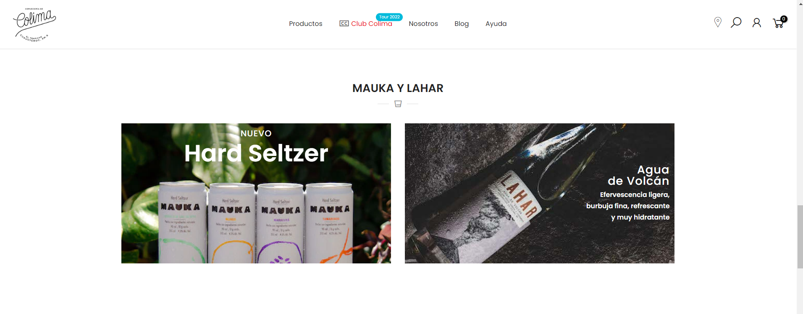

Ibamos charlando cosas que teniamos que cambiar como poner el logo en medio, sacar los iconos del costado e ir eligiendo colores. 

El footer tambien fue algo en lo que estuvimos inspirados, en el tamaño, color y forma . Es muy parecido al de Arbusta .

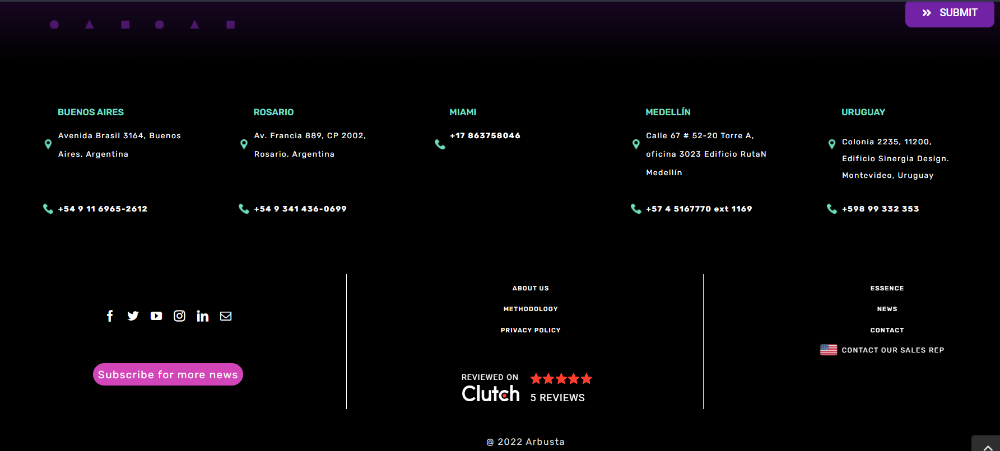

Nuestro footer esta 100% inspirado en el de Arbusta .

_Miercoles 13/04_ : Comienzo de wireframe .  
Este día Nati sugirió una plataforma para ir volcando nuestras ideas en él . La plataforma elegida había sido *Whimiscal* https://whimsical.com/proyecto-Ns7c8K4aZh3rmAxjK9bai6 . Nuestro primer wireframe donde plasmamos todas nuestras ideas, gustos e inspiraciones :

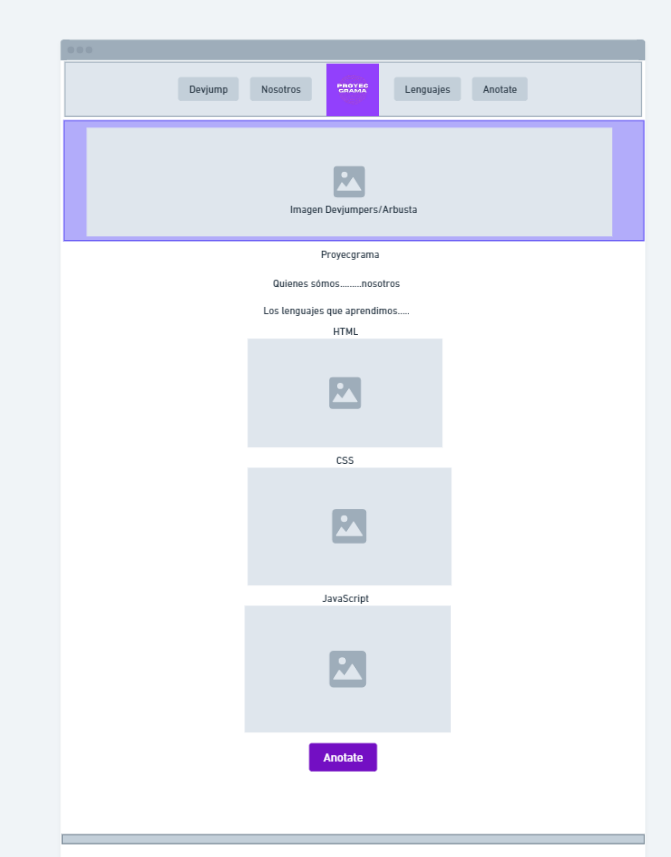     Todavia faltaba tomar decisiones de tipografía, colorimetría, secciones e imagenes . *Este wireframe fue inspiracíon para el ultimo elegido* .

_Lunes 18/04_ : Elección de nombre, logo y secciones que Proyecgrama iba a tener . Seguimiento del wireframe .  
Este día tuvimos nuestra primer Daily grupal . En la daily charlamos lo que iba a hacer cada uno y si teniamos algun impedimento o algo para decir . Gonza y Nati continuaron con el wireframe de cada sección y dispositivo . Seguimos tirando ideas para cada una de las secciones , probamos tonalidades dentro de los colores de Arbusta y tipografías acordes. Guada creó el nombre y diseño el logo . Se creó el repositorio y se fueron completando los README . 

## Logo y Secciones

   --  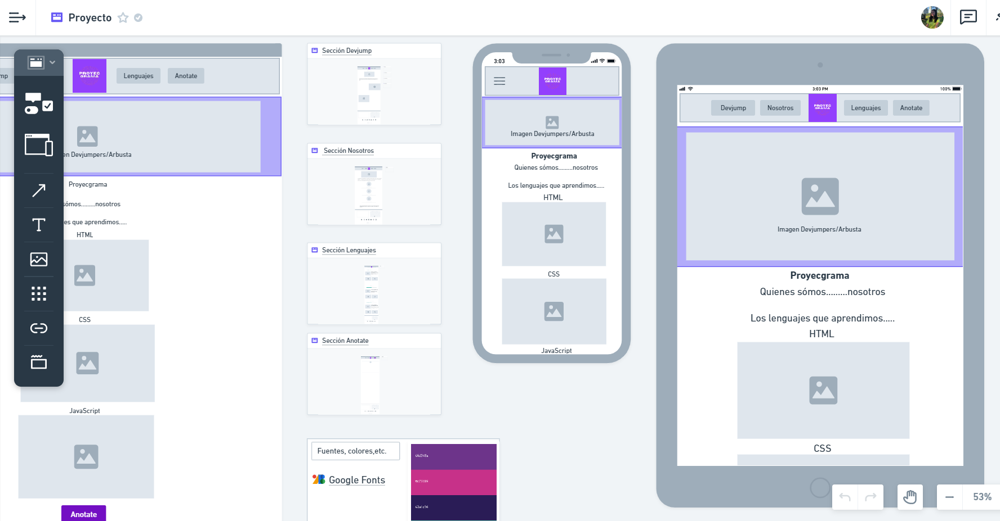 

_Martes 19/04_ : Seguimos con el wireframe.  
Surgieron dudas en el color del logo, en si iba a combinar con el resto de la página, asi que estuvimos probando nuevos logos .

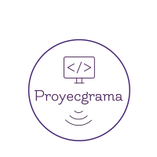   --     Finalmente decidimos dejar el anterior ya que queriamos darle color a la pagina, que sea llamativa visualmente y con el color blanco de estos no pasaba .

_Miercoles 20/04_ : Nuevos cambios . Nuevo integrante . Nuevas ideas . Rehicimos el wireframe .  
Este dia fue de cambios, se unió Lauti, el llego con un proyecto en mente distinto y ideas diferentes . El grupo le comentó todo lo que habiamos hecho hasta este día y estaba dispuesto a recibir ideas y cambios . Mostramos el wireframe y allí surgieron muuuchas cosas . 

## Complicaciones 

Principalmente la plataforma que usabamos _Whismical_ no se amoldaba a lo que necesitabamos, habían cosas que no nos dejaba realizar (como modificar el ancho y alto de una imagen) . Entonces, Lauti sugirió la plataforma _Figma_ él ya estaba utilizandola con su grupo anterior entonces se ofreció a explicarnos sobre esta e ir pasando todo el wireframe ahi . Accedimos todos y juntos fuimos definiendo junto con Lauti el nuevo wireframe .  
Todo el resto del dia fue terminar el nuevo wireframe que nos gustara y estemos todos de acuerdo . 

## Toma de decisiones finales 

_Jueves 21/04_ : Trabajamos en el refinamiento. Volvimos a las preguntas esenciales como ¿Cuáles eran los requisitos? Y con base en esto pensamos en las secciones de nuestro sitio .
 
A fin de la reunión decidimos dividir tareas para agilizar el proceso teniendo en cuenta el tiempo pactado .

Guadalupe: Exclusivamente de la documentación .  
Natali: De la maquetación del formulario de Login y Registro en su tamaño escritorio y responsivo.  
Gonzalo: De la maquetación de la sección de los diferentes lenguajes, con foco en cumplir los requerimientos de: “Clases con párrafos que explique la misma” y “Visualización por lenguaje” .  
Lautaro: De la maquetación de la página de Inicio o Home, asegurándose de ultimar detalles pactados en la Dayli.  

[Wireframe elegido](https://www.figma.com/file/6Vz4FdXkiOXlXJduHf1jVP/Untitled?node-id=0%3A1)

## Día del Review

_Viernes 22/04_ : El día de la presentación con los clientes. Presentamos el Wireframe, hablamos como lo organizamos, ha comentado todo el equipo. Recibimos el feedback y algunas cosas que mejorar como en la parte que nos toca a cada uno, agregar la introducción de nosotros, entre otras modificaciones que lo vamos a explicar a continuación.

# Semana del armado de la página

_Lunes 25/04_ : Estuvimos modificando y agregando parte del Wireframe.

Nos organizamos cada integrante con tareas:

-Lautaro Coria: Agregar la parte logueada en wireframe, la descripción de como se verá el contenido de cada lenguaje

-Guadalupe Garcilazo: Agregar el menú(con la foto de perfil) en desktop y dispositivos móviles.

-Natalí Lescano: Modificar y agregar redes en el formulario de registro e inicio de sesión.

-Gonzalo Alvarez: Agregar también el contenido del 

_Martes 26/04_ Asistimos a la oficina y no avanzamos mucho con el proyecto a razón de la evaluación, y estabamos enfocados en
estudiar y repasar ese día.
Nos organizamos de empezar a hacer el html y css de la página. Por partes, contamos con el footer terminado.

Algunas modificaciones con el login:

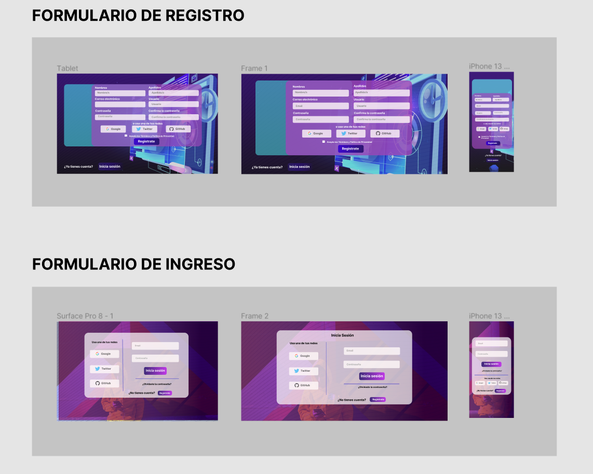

Se agregó para registrarse e iniciar sesión con redes sociales conocidas, como una alternativa.

_Miércoles 27/04_ : Damos últimos toques al Wireframe. Agregar contenido en la sección de los lenguajes. Arreglar el Registro e Inicio de Sesión. Agregar el menú que aparecerá en los  dispositivos móviles.
La parte cuando no se está logueado y la que sí en el responsive.  
Acordamos ir haciendo parte del html del index, secciones, header, footer y los formularios. Crear el README para el Manual para entender la navegación de nuestra página.

Agregamos la sección logueada: 

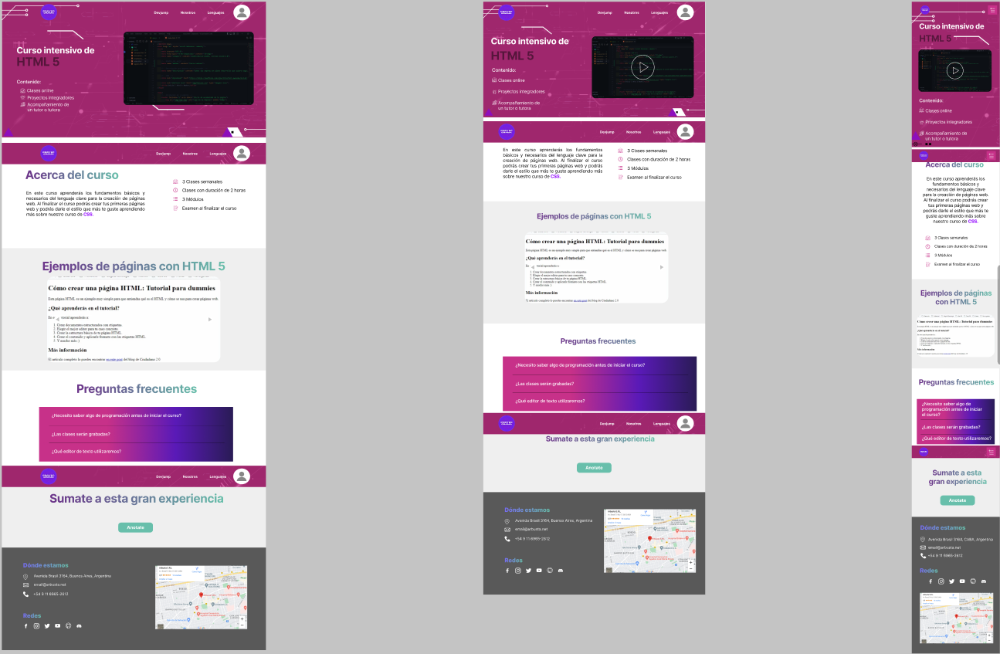

El menú de cuando se está iniciado sesión.

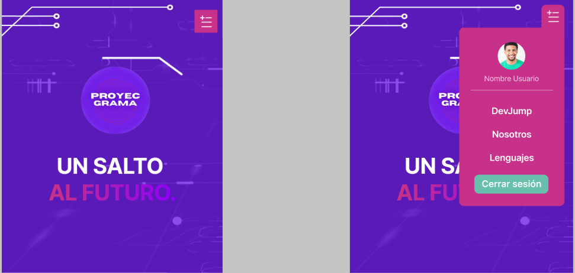

Descripción del contenido del lenguaje

Aparte comenzamos con el maquetado en código:

Lauti: Con el header

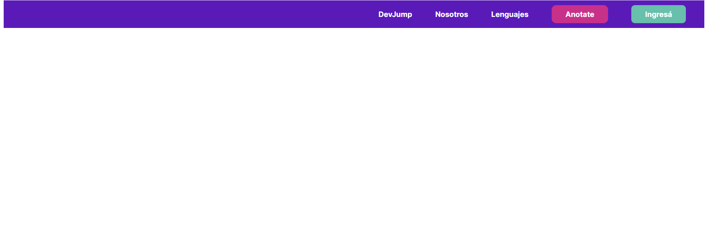

Guada: Con la parte principal de la página

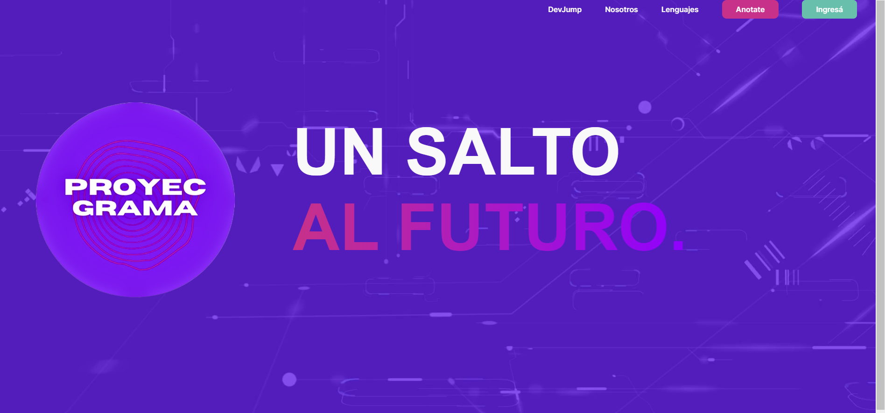

Gonzalo: Los fornularios de registro e inicio de sesión

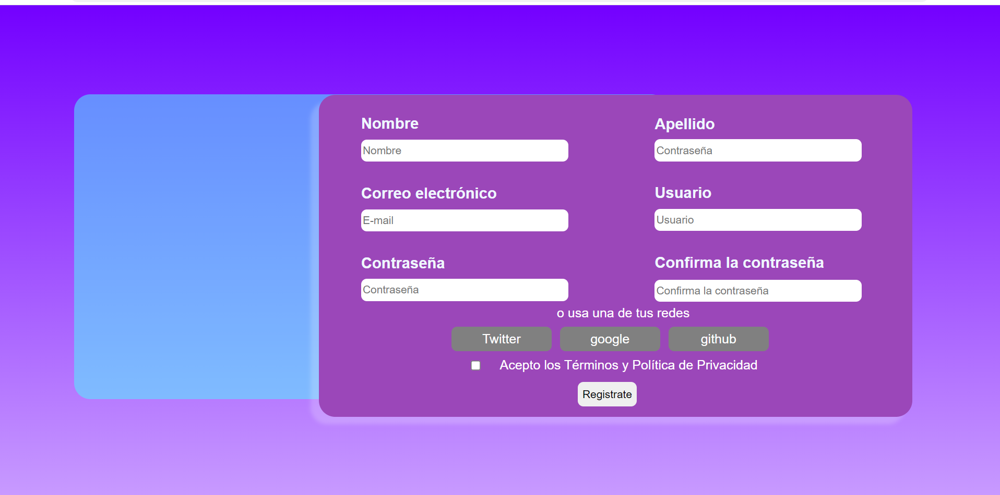

Natali: con la seccion HTML

Cabe destacar que se muestra hasta lo que llegamos en ese momento

_Jueves 28/04_ Seguir con el código, organizamos bien en la carpetas del repositorio. Practicar y preparar la presentación para la
próxima Review. 

Lautaro: Parte del código con la descripción del lenguaje cuando se está iniciado sesión.

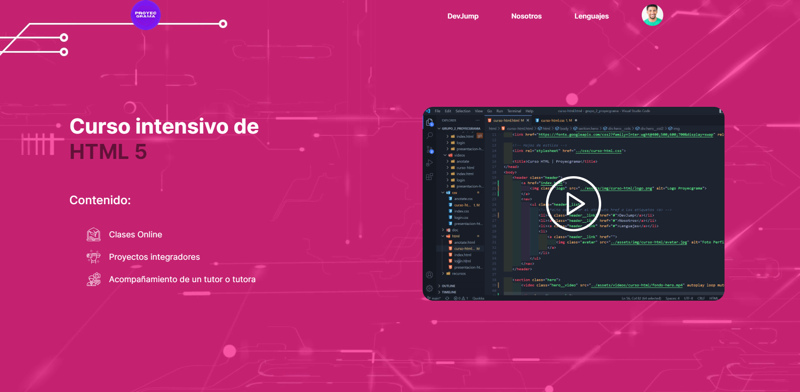

Gonzalo: Parte del código con los formularios 

Natali: Con la documentación y organización del equipo.

Guadalupe: Parte del código con el index

Hasta el momento avanzamos con el código, pusheamos y avismos. Mucha ayuda y apoyo del gran equipo.